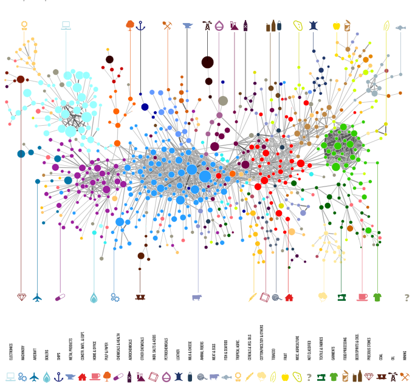

```{r setup, include=FALSE}
knitr::opts_chunk$set(echo = FALSE)
```

# Data

## Sources

All of the product data shown on the OEC site is classified using either 

- *SITC* (Standard International Trade Classification)
- *HS* (Harmonized System).

For historical SITC classification data (1962 - 2000), the OEC is using data from [@worldtrade2005]. For more recent data (2001 - 2016), the OEC is using data provided by [UN COMTRADE](http://comtrade.un.org/).

## Availability

|Classification|Availability|
|--------------|------------|
|HS rev 1992   |1992 – 2016 |
|HS rev 1996   |1996 – 2016 |
|HS rev 2002   |2002 – 2016 |
|HS rev 2007   |2007 – 2016 |
|HS rev 2012   |2012 – 2016 |
|SITC rev 2    |2000 – 2016 |

## Tidy Data

- I followed Tidy Data principles to obtain an output that in our opinion can be useful for others.
- Tidy Data principles are closely tied to those of relational databases and Codd’s relational algebra. 
- I did not innovate at this point and I only limited to follow the principles exposed in [@tidydata2014] and [@r4ds2016] above all matters related to performing code and coding style.

## Tidy Data

```{r, echo = F, fig.cap="Data pipeline", fig.width=10}
knitr::include_graphics("images/tidy-data.pdf")
```

## Filling some gaps in our data

- For each NA or 0 import/export value I tried to fill the gap. 
- If country A reported NA or 0 exports (imports) of product B to (from) country C, then I searched what country C reported of imports (exports) of product B from (to) country A.

## Filling some gaps in our data

I provide column `marker` indicating those replacements under this labels:

|marker|meaning                              |
|------|-------------------------------------|
|1     |imports with replacements            |
|2     |exports with replacements            |
|3     |imports and exports with replacements|
|NA    |no replacements needed               |

## Filling some gaps in our data

```{r, echo = F, fig.cap="Example of gap in data", fig.width=10}
knitr::include_graphics("images/clean-data.pdf")
```

## Countries not included in rankings and indicators

* The curated data includes all the countries available from UN Comtrade data.
* RCA based calculations such as ECI, PCI, Proximity consider 128 countries that account for 
    + 99% of world trade
    + 97% of the world’s total GDP
    + and 95% of the world’s population according to [@atlas2014].

## Countries not included in rankings and indicators

I considered simultaneously:

* Countries with population greater or equal to 1.2 million
* Countries whose traded value is greater or equal than 1 billion

## Countries not included in rankings and indicators

```{r, echo = F, fig.cap="Country filtering", fig.width=10}
knitr::include_graphics("images/countries.pdf")
```

# Hardware & Software

## Hardware

- Intel© Xeon 2.27GHz processor (eight cores)
- 32 GB (four DDR3 cards of eight gigabytes each)

## Software

- Ubuntu Server 16.04
- R 3.4.3
- RStudio Server Pro 1.1
- I built R from binaries and linked to Intel MKL 2017 so I benefit from multi-threaded BLAS/LAPACK libraries

## Packages

- packrat
- pacman
- data.table
- dplyr
- tidyr
- doParallel
- Matrix
- RcppArmadillo
- feather
- RPostgreSQL

## Limitations

- The project is divided in three big tasks:
    + download raw data
    + clean data following Tidy Data principles
    + write data to PostgreSQL DB

## Limitations

- Functions such as download (i.e run `wget` on eight cores) do not suppose a problem
- Functions that involve matrix computation (i.e compute economic complexity rankings) were run on four cores because I detected a *large* overhead due to data communication with cores when using more cores.

## Efficiency

Slowness has several explanations
  
- Running many processes
- Hardware bottlenecks (i.e faster RAM versus more RAM, same for HDD)
- Numerical libraries
- Coding

## Efficiency

\center{\Large{Numerical libraries can make a difference}}

## Efficiency

```{r, echo = F, fig.cap="RStudio admin panel while running scripts to clean data and compute economic complexity rankings", fig.width=10}

```

## Efficiency

```{r, echo = F, fig.cap="Performance exhibited running unmodified Microsoft benchmark script (edited R builds location)", fig.width=10, message=FALSE}
library(ggplot2)
library(readxl)
library(viridis)

microsoft_test <- read_excel("benchmark-results.xlsx")

ggplot(microsoft_test, aes(x = operation, y = time, fill = rversion)) +
  geom_col(position = "dodge") +
  labs(x = "",  y = "Elapsed time (seconds)", fill = "") +
  theme_minimal(base_size = 15) +
  theme(legend.position = "bottom") +
  scale_fill_viridis(end = 0.65, discrete = TRUE) +
  coord_flip() +
  ggtitle("Different R builds operation time")
```

## Efficiency

```{r, echo = F, fig.cap="Performance exhibited running modified ATT script (modified to run fresh 100 times and then store the median result)", fig.width=10, message=FALSE}
library(dplyr)
library(tidyr)

att_test <- read_excel("benchmark-results.xlsx", sheet = "Sheet2") %>% 
  rename(`R built with Intel MKL` = RMKL,
         `R built with OpenBLAS` = RopenBLAS,
         `Microsoft R Open` = MicrosoftROpen) %>% 
  gather(rversion, mediantime, -OperationsMedianTime) %>% 
  rename(operation= OperationsMedianTime)

ggplot(att_test, aes(x = operation, y = mediantime, fill = rversion)) +
  geom_col(position = "dodge") +
  labs(x = "",  y = "Elapsed time (seconds)", fill = "") +
  theme_minimal(base_size = 15) +
  theme(legend.position = "bottom") +
  scale_fill_viridis(end = 0.65, discrete = TRUE) +
  coord_flip() +
  ggtitle("Different R builds operation median time")
```

# Coding

## Syntax

- I used [Tidyverse Style Guide](http://style.tidyverse.org/)
- As cornerstone references for performant code I followed [@advancedr2014] and [@masteringsoftware2017]
- Readability is *really* important (specially after one ytd and you don't remember what you were doing)
- Over this project I moved from doing most of tasks with `data.table` to `tidyverse` because of *readability*

## Performant code

- Some matrix operations are written in Rcpp to take advantage of C++ speed
- To take full advantage of hardware and numerical libraries I are using sparse matrices as it is explained in [@rcpparmadillo2018]
- As a general reccomendation using sparse matrices is a *good* practise with respect to both speed and memory usage

## Reproducibility

- The full project is organized in different GitHub repositories
- Uploading to GitHub is not enought 
- For full reproducibility I thought about
    + Using packrat to have an isolated repository of packages
    + Making packages bundle available
    + Considering literate programming to write scripts
    + Documenting everything
    
## Reproducibility

- I have reproducility flaws
    + UN COMTRADE access
    + Parallelization is OS-specific
- Potential solutions
    + Collaborate with UN COMTRADE
    + Move to a parallelization type different than `FORK`
    
# Economic Complexity

## What is Economic Complexity?

- We owe to Adam Smith the idea that the division (specialization) of labor is the secret of the wealth of nations.
- The division of labor into markets and organizations is what allows the knowledge held by few to reach many, making us collectively wiser.

## What is Economic Complexity?

- The complexity of an economy is related to the multiplicity of useful knowledge embedded in it. 
- Because individuals are limited in what they know, the only way societies can expand their knowledge base is by facilitating the interaction of individuals in increasingly complex networks in order to make products. 
- We can measure economic complexity by the mix of these products that countries are able to make.

## What is Economic Complexity?

- Some products, like medical imaging devices or jet engines, embed large amounts of knowledge and are the results of very large networks of people and organizations. 
- These products cannot be made in simpler economies that are missing parts of this network’s capability set. 
- Economic complexity, therefore, is expressed in the composition of a country’s productive output and reflects the structures that emerge to hold and combine knowledge.
    
## What is Economic Complexity?

In particular [@mesuringcomplexity2015] and [@interpretationreflections2014] provide useful technical details.

## Revealed Comparative Advantage (RCA)

Let $x_{c,p}$ represent the exports of country $c$ in product $p$, we can express the Revealed Comparative Advantage that country $c$ has in product $p$ as:

\begin{equation}
\label{eq:rca}
RCA_{c,p} = \frac{x_{c,p}}{\sum_c x_{c,p}} / \frac{\sum_p x_{c,p}}{\sum_{c}\sum_{p} x_{c,p}}
\end{equation}

## Revealed Comparative Advantage (RCA)

\center{\Large{RCA is the basic indicator to measure economic complexity}}

## Revealed Comparative Advantage (RCA)

**Exercise**

- Open RStudio and load [`fantasy_world_long.rdata`](http://pacha.hk/r-users-santiago-talk/fantasy_world_long.rdata) to your workspace
- Use `dplyr` to compute RCA
- Remember RCA definition
$$
RCA_{c,p} = \frac{x_{c,p}}{\sum_c x_{c,p}} / \frac{\sum_p x_{c,p}}{\sum_{c}\sum_{p} x_{c,p}}
$$

## Revealed Comparative Advantage (RCA)

Exploring the dataset

```{r, echo = T}
library(dplyr)
load("fantasy_world_long.rdata")
fantasy_world_long %>% print(n = 3)
```

## Revealed Comparative Advantage (RCA)

```{r, eval=FALSE, echo=T}
rca_long <- fantasy_world_long %>% 
  rename(c = country, 
         p = product, 
         xcp = export_val) %>% 
  group_by(c) %>% 
  mutate(sum_c_xcp = sum(xcp)) %>% 
  group_by(p) %>% 
  mutate(sum_p_xcp = sum(xcp)) %>% 
  ungroup() %>% 
  mutate(sum_c_p_xcp = sum(xcp)) %>% 
  mutate(rca = (xcp / sum_c_xcp) / 
           (sum_p_xcp / sum_c_p_xcp))
```

## Revealed Comparative Advantage (RCA)

```{r}
rca_long <- fantasy_world_long %>% 
  rename(c = country, 
         p = product, 
         xcp = export_val) %>% 
  group_by(c) %>% 
  mutate(sum_c_xcp = sum(xcp)) %>% 
  group_by(p) %>% 
  mutate(sum_p_xcp = sum(xcp)) %>% 
  ungroup() %>% 
  mutate(sum_c_p_xcp = sum(xcp)) %>% 
  mutate(rca = (xcp / sum_c_xcp) / 
           (sum_p_xcp / sum_c_p_xcp))

rca_long %>% select(c, p, rca) %>% print(n = 5)
```

## Revealed Comparative Advantage (RCA)

**Exercise**

- Now create a matrix $M$ with entries
\begin{equation}
m_{c,p} = \begin{cases}1 & \text{ if } RCA_{c,p} \geq 1\cr 0 & \text{ otherwise}  \end{cases}
\end{equation}
- Try to create it as if the dataset was actually large

## Revealed Comparative Advantage (RCA)

```{r, echo=TRUE}
rca_matrix <- rca_long %>%
      select(c, p, rca) %>%
      mutate(rca = ifelse(rca > 1, 1, 0)) %>% 
      spread(p, rca)
```

## Smooth Revealed Comparative Advantage (SRCA)

- In the OEC real data we use a modified RCA to reduce trade fluctuations
- We smooth changes in export volumes induced by the price fluctuation of commodities by using a modification of \eqref{eq:rca} in which $x_{c,p}$ is averaged over the previous three years by using weights:
$$
SRCA_{c,p}^{(t)} = \frac{\hat{x}_{c,p}^{(t)}}{\sum_c \hat{x}_{c,p}^{(t)}} / \frac{\sum_p \hat{x}_{c,p}^{(t)}}{\sum_{c}\sum_{p} \hat{x}_{c,p}^{(t)}}
$$
Where
$$
\hat{x}_{c,p}^{(t)} = \frac{2x_{c,p}^{(t)} + x_{c,p}^{(t-1)} + x_{c,p}^{(t-2)}}{4}
$$

## Diversity and Ubiquity

- With $M$ defined as in the previous sections, we can measure Diversity and Ubiquity simply by summing over the rows or columns of that matrix. 
- Diversity: $$k_{c}^{(0)} = \sum_p m_{c,p}$$
- Ubiquity: $$k_{p}^{(0)} = \sum_c m_{c,p}$$

## Diversity and Ubiquity

**Exercise**

- Compute diversity and ubiquity
- Store the result in two matrices $D$ and $U$

## Diversity and Ubiquity

```{r, echo=T}
diversity <- rca_long %>% select(c) %>% distinct()
ubiquity <- tibble(p = colnames(rca_matrix)) %>% 
  filter(row_number() > 1)
    
rca_matrix <- rca_matrix %>% 
  select(-c) %>% 
  as.matrix()
```

## Diversity and Ubiquity

```{r, echo=T, message=F}
# convert to sparse class
library(Matrix)
rca_matrix <- Matrix(rca_matrix, sparse = T)
    
diversity <- diversity %>%
  mutate(val = rowSums(rca_matrix)) %>%
  filter(val > 0)
    
ubiquity <- ubiquity %>%
  mutate(val = colSums(rca_matrix)) %>%
  filter(val > 0)
```

## Diversity and Ubiquity

```{r, echo=T, message=F}
rownames(rca_matrix) <- diversity$c

D <- as.matrix(diversity$val, ncol = 1)
U <- as.matrix(ubiquity$val, ncol = 1)
```

## Reflections Method

- The information that diversity and ubiquity carry can be used each one to correct the other. 
- For countries, this is to calculate the average ubiquity of the products that it exports. 
- For products, this is to calculate the average diversity of the countries that make them. 

## Reflections Method

The last slide can be expressed by the recursion:

\begin{equation}
\label{eq:kcn}
k_{c}^{(n)} = \frac{1}{k_{c}^{(0)}} \sum_p m_{c,p} k_{p}^{(n-1)}
\end{equation}

\begin{equation}
\label{eq:kpn}
k_{p}^{(n)} = \frac{1}{k_{p}^{(0)}} \sum_c m_{c,p} k_{c}^{(n-1)}
\end{equation}

## Reflections Method

We then insert \eqref{eq:kpn} into \eqref{eq:kcn} to obtain:

\begin{equation}
\label{eq:kcn2}
k_{c}^{(n)} = \sum_c \left[\frac{1}{k_{c}^{(0)}} \sum_p m_{c,p} \frac{1}{k_{p}^{(0)}} m_{c,p} \right] k_{c}^{(n-2)}
\end{equation}

## Reflections Method

**Exercise**

- Remove null rows and columns from `rca_matrix` using the names in $D$ and $U$
- Store the result as `Mcp` and remove `rca_matrix`
- Save $D$ and $U$ using `numeric` class as `kc0` and `kp0` respectively

## Reflections Method

```{r, echo=T}
# remove null rows and cols
Mcp <- rca_matrix[
  which(rownames(rca_matrix) %in% unlist(diversity$c)) , 
  which(colnames(rca_matrix) %in% unlist(ubiquity$p))]
rm(rca_matrix)

# diversity and ubiquity following the Atlas notation
kc0 <- as.numeric(D)
kp0 <- as.numeric(U)
```

## Reflections Method

**Exercise**

- Using `kc0` and `kp0` create two matrices `kc` and `kp` with 20 columns each
- Compute $kc$ $j^{th}$ column from of $kp$ $j-1^{th}$ column
- Compute $kp$ $j^{th}$ column from $kc$ $j-1^{th}$ column

Remember
$$
k_{c}^{(n)} = \frac{1}{k_{c}^{(0)}} \sum_p m_{c,p} k_{p}^{(n-1)}
\quad \quad
k_{p}^{(n)} = \frac{1}{k_{p}^{(0)}} \sum_c m_{c,p} k_{c}^{(n-1)}
$$

## Reflections Method

```{r, echo=T}
kcinv <- 1 / kc0
kpinv <- 1 / kp0

# create empty matrices
kc <- Matrix(0, nrow = length(kc0), ncol = 20, sparse = T)
kp <- Matrix(0, nrow = length(kp0), ncol = 20, sparse = T)

# fill the first column with kc0 and kp0 to start iterating
kc[ ,1] <- kc0
kp[ ,1] <- kp0
```

## Reflections Method

```{r, echo=T}
# compute cols 2 to 20 by iterating from col 1
for (c in 2:ncol(kc)) {
  kc[ ,c] <- kcinv * (Mcp %*% kp[ ,(c - 1)])
  kp[ ,c] <- kpinv * (t(Mcp) %*% kc[ ,(c - 1)])
}
```

## Reflections Method

- The interpretation of the scores changes when considering odd or even iteration order $n$
- High-order iterations are difficult to interpret, and the process asymptotically converges to a trivial fixed point
- To compute rankings I used `kc` $19^{th}$ column and `kp` $20^{th}$ column

## Economic Complexity Index (ECI)

From the Reflections Method,the Economic Complexity Index (ECI) is defined as:

\begin{equation}
\label{eq:eci}
ECI_c = \frac{v_c - \mu_{v}}{\sigma_{v}}
\end{equation}

Where

* $\vec{v}$ is defined as `v <- kc[ ,19]`.
* $\mu_v = \sum_c v_c / C$ (mean of $\vec{v}$) 
* $\sigma_v = \sqrt{\sum_c (v_c - \mu_v)^2 / (C - 1)}$ (standard deviation of $\vec{v}$)

## Product Complexity Index (PCI)

Similar to the Economic Complexity Index (ECI), the Product Complexity Index (PCI) is defined as:

\begin{equation}
\label{eq:pci}
PCI_p = \frac{w_p - \mu_{w}}{\sigma_{w}}
\end{equation}

Where

* $\vec{w}$ is defined as `w <- kp[ ,20]`
* $\mu_w = \sum_p w_p / P$ (mean of $\vec{w}$)
* $\sigma_w = \sqrt{\sum_p (w_p - \mu_w)^2 / (P - 1)}$ (standard deviation of $\vec{w}$)

## Economic and Product Complexity Index

**Exercise**

- Compute ECI and PCI
- Arrange the results in decreasing order
- Show the results and conclude

## Economic and Product Complexity Index

```{r, echo = T}
eci_reflections <- as_tibble(
      (kc[ ,19] - mean(kc[ ,19])) / sd(kc[ ,19])
    ) %>%
      mutate(country = diversity$c) %>%
      select(country, value) %>%
      arrange(desc(value))
```

## Economic and Product Complexity Index

```{r, echo=F}
library(knitr)
kable(eci_reflections %>% filter(row_number() <= 5), digits = 3, caption = 'ECI for Fantasy World (top 5)', longtable = FALSE)
```

## Economic and Product Complexity Index

```{r, echo=T}
pci_reflections <- as_tibble(
      (kp[, 20] - mean(kp[ ,20])) / sd(kp[ ,20])
    ) %>%
      mutate(product = ubiquity$p) %>%
      select(product, value) %>%
      arrange(desc(value))
```

## Economic and Product Complexity Index

```{r, echo=F}
kable(pci_reflections %>% filter(row_number() <= 5), digits = 3, caption = 'PCI for Fantasy World (top 5)', longtable = FALSE)
```

## Proximity

- To make products you need chunks of embedded knowledge which we call capabilities. 
- The capabilities needed to produce one good may or may not be useful in the production of other goods.
- Capabilities are not observed directly,
- Proximity is a measure that infers the similarity between the capabilities required by a pair of goods by looking at the probability that they are coexported. 

## Proximity

**Example**

- In the year 2008, 17 countries exported wine, 24 exported grapes and 11 exported both, all with $RCA > 1$. 
- Then, the product proximity between wines and grapes is 11/24=0.46.
- Note that I divide by 24 instead of 17 to minimize false positives

## Proximity

For a pair of goods $p$ and $p'$ Product Proximity $\Phi \in \mathbb{R}^{P\times P}$ is defined as:
$$\Phi = (M^t M) \odot U$$
Where $\odot$ denotes element-wise multiplication and 
$$u_{p,p'} = 1 / \max(k_{p}^{(0)}, k_{p'}^{(0)})$$
In other terms, each entry of $\Phi$ corresponds to:
$$
\phi_{p,p'} = \frac{\sum_c m_{c,p} m_{c,p'}}{\max(k_{p}^{(0)}, k_{p'}^{(0)})}
$$

## Proximity

```{r, echo = F, fig.cap="An illustrative example for the product proximity measure"}
knitr::include_graphics("images/proximity.pdf")
```

## Proximity

Country Proximity $\Lambda \in \mathbb{R}^{C\times C}$ is similarly defined:

$$
\Lambda = (MM^t) \odot D
$$

Where 
$$d_{c,c'} = 1 / \max(k_{c}^{(0)}, k_{c'}^{(0)})$$

In other terms, each entry of $\Lambda$ corresponds to:
$$
\lambda_{c,c'} = \frac{\sum_p m_{c,p} m_{c,p'}}{\max(k_{c}^{(0)}, k_{c'}^{(0)})}
$$

## Proximity

**Exercise**

- Write an Rcpp function titled `proximity_products_denominator`
- Use that function to make the next code work:

```{r, eval = F, echo = T}
Phi_pp <- (t(Mcp) %*% Mcp) / 
  proximity_products_denominator(Mcp, U, cores = n_cores)
Phi_pp_l <- Phi_pp
Phi_pp_l[upper.tri(Phi_pp_l, diag = T)] <- NA

Phi_pp_long <- as_tibble(as.matrix(Phi_pp_l)) %>% 
  mutate(id = rownames(Phi_pp)) %>% 
  gather(id2, value, -id) %>% 
  filter(!is.na(value))
```

## Proximity

```{r engine='Rcpp', echo = T, eval = F}
#include <omp.h>
#include <RcppArmadillo.h>

// [[Rcpp::depends(RcppArmadillo)]]
// [[Rcpp::plugins(openmp)]]

using namespace Rcpp;

// [[Rcpp::export]]
arma::mat proximity_products_denominator(
    arma::sp_mat Mcp, arma::mat U, int cores = 1) {
  // Constants
  int N = (int) Mcp.n_cols;
```

## Proximity

```{r engine='Rcpp', echo = T, eval = F}
// Output
  arma::mat Phi_down(N,N);
  
  // Filling with ones
  Phi_down.ones();
  
  // Number of cores
  omp_set_num_threads(cores);
```

## Proximity

```{r engine='Rcpp', echo = T, eval = F}
#pragma omp parallel for shared(Mcp, U, N, Phi_down) default(none)
  for (int i=0; i<N; i++)
    for (int j=0; j<=i; j++) {
      // Fill the lower part
      Phi_down.at(i,j) = std::max(U(i,0), U(j,0));
      // Fill the upper part
      Phi_down.at(j,i) = Phi_down.at(i,j);
    }
    
    return Phi_down;
}
```

## Proximity

```{r, echo = T}
Rcpp::sourceCpp("proximity_products_denominator.cpp")
n_cores <- 4

Phi_pp <- (t(Mcp) %*% Mcp) / 
  proximity_products_denominator(Mcp, U, cores = n_cores)
Phi_pp_l <- Phi_pp
Phi_pp_l[upper.tri(Phi_pp_l, diag = T)] <- NA

Phi_pp_long <- as_tibble(as.matrix(Phi_pp_l)) %>% 
  mutate(id = rownames(Phi_pp)) %>% 
  gather(id2, value, -id) %>% 
  filter(!is.na(value))
```

## Proximity

```{r, echo = F}
kable(Phi_pp_long %>% filter(row_number() <= 5), digits = 3, caption = 'Exploring proximity results')
```

## Proximity

**Exercise**

- Write an Rcpp function titled `proximity_countries_denominator`
- Use that function to make the next code work:

```{r, eval = F, echo = T}
Phi_cc <- (Mcp %*% t(Mcp)) / 
  proximity_countries_denominator(Mcp, D, cores = n_cores)
Phi_cc_l <- Phi_cc
Phi_cc_l[upper.tri(Phi_cc_l, diag = T)] <- NA
    
Phi_cc_long <- as_tibble(as.matrix(Phi_cc_l)) %>% 
  mutate(id = rownames(Phi_cc)) %>% 
  gather(id2, value, -id) %>% 
  filter(!is.na(value))
```

## Proximity

```{r engine='Rcpp', echo = T, eval = F}
#include <omp.h>
#include <RcppArmadillo.h>

// [[Rcpp::depends(RcppArmadillo)]]
// [[Rcpp::plugins(openmp)]]

using namespace Rcpp;

// [[Rcpp::export]]
arma::mat proximity_countries_denominator(
    arma::sp_mat Mcp, arma::mat D, int cores = 1) {
  // Constants
  int M = (int) Mcp.n_rows;
```

## Proximity

```{r engine='Rcpp', echo = T, eval = F}
// Output
  arma::mat Phi_down(M,M);
  
  // Filling with ones
  Phi_down.ones();
  
  // Number of cores
  omp_set_num_threads(cores);
```

## Proximity

```{r engine='Rcpp', eval = F, echo = T}
#pragma omp parallel for shared(Mcp, D, M, Phi_down) default(none)
  for (int i=0; i<M; i++)
    for (int j=0; j<=i; j++) {
      // Fill the lower part
      Phi_down.at(i,j) = std::max(D(i,0), D(j,0));
      // Fill the upper part
      Phi_down.at(j,i) = Phi_down.at(i,j);
    }
    
    return Phi_down;
}
```

## Proximity

```{r, echo = T}
Rcpp::sourceCpp("proximity_countries_denominator.cpp")
n_cores <- 4

Phi_cc <- (Mcp %*% t(Mcp)) / 
  proximity_countries_denominator(Mcp, D, cores = n_cores)
Phi_cc_l <- Phi_cc
Phi_cc_l[upper.tri(Phi_cc_l, diag = T)] <- NA
    
Phi_cc_long <- as_tibble(as.matrix(Phi_cc_l)) %>% 
  mutate(id = rownames(Phi_cc)) %>% 
  gather(id2, value, -id) %>% 
  filter(!is.na(value))
```

## Proximity

```{r, echo = F}
kable(Phi_cc_long %>% filter(row_number() <= 5), digits = 3, caption = 'Exploring proximity results')
```

# Product Space

## Product Space

- To visualize the product space we use some simple design criteria. 
- First, we want the visualization of the product space to be a connected network. 
- The second criteria is that we want the network visualization to be relatively sparse. 
- Trying to visualize too many links can create unnecessary visual complexity where the most relevant connections will be occluded.

## Product Space

```{r, echo = F, fig.cap="The product space", fig.width=10}

```

## Product Space

**Exercise**

- Create a tibble that includes all pairs with a product proximity higher or equal than 0.4
- Use `ggraph` package to sketch Fantasy World's Product Space
- Ignore any disconnected products for now

## Product Space

```{r, eval = F, echo = T}
if (!require("pacman")) install.packages("pacman")
p_load(igraph, ggraph)
```

## Product Space

```{r, eval = F, echo = T}
set.seed(1717)

Phi_pp_long %>%
  filter(value >= 0.4) %>%
  graph_from_data_frame() %>%
  ggraph(layout = "fr") +
  geom_edge_link(aes(edge_alpha = value,  edge_width = value), 
                 edge_colour = "#a8a8a8") +
  geom_node_point(color = "darkslategray4", size = 8) +
  geom_node_text(aes(label = name), vjust = 2.2) +
  ggtitle("Sketch of Fantasy World's Product Space") +
  theme_void(base_size = 15)
```

## Product Space

```{r, eval = T, echo = F, message=F}
if (!require("pacman")) install.packages("pacman")
p_load(igraph)
p_load_gh("thomasp85/ggraph")

set.seed(1717)

Phi_pp_long %>%
  filter(value >= 0.4) %>%
  graph_from_data_frame() %>%
  ggraph(layout = "fr") +
  geom_edge_link(aes(edge_alpha = value, edge_width = value), 
                 edge_colour = "#a8a8a8") +
  geom_node_point(color = "darkslategray4", size = 8) +
  geom_node_text(aes(label = name), vjust = 2.2) +
  ggtitle("Sketch of Fantasy World's Product Space") +
  theme_void(base_size = 15)
```

## Product Space

**Exercise**

- Obtain a Maximum Spanning Tree by using `ape` package
- Append missing pairs of products with a proximity higher than 0.3 to your MST
- Sketch the connected Product Space

## Product Space

```{r, eval = F, echo = T}
p_load(ape)

Phi_pp_2 <- (t(Mcp) %*% Mcp) / 
  proximity_products_denominator(Mcp, U, cores = n_cores)
Phi_pp_3 <- -1 * Phi_pp_2

mst_pp <- ape::mst(Phi_pp_3)
mst_pp[upper.tri(mst_pp, diag = T)] <- NA
class(mst_pp) <- "matrix"
```

## Product Space

```{r, eval = F, echo = T}
mst_pp_long <- as_tibble(mst_pp) %>% 
  mutate(id = rownames(mst_pp)) %>% 
  gather(id2, value, -id) %>% 
  filter(!is.na(value),
         value > 0)
```

## Product Space

```{r, eval = F, echo = T}
Phi_pp_2[upper.tri(Phi_pp_2, diag = T)] <- NA

additions_pp_long <- as_tibble(as.matrix(Phi_pp_2)) %>% 
  mutate(id = rownames(mst_pp)) %>% 
  gather(id2, value, -id) %>% 
  filter(!is.na(value),
         value >= 0.3) %>% 
  anti_join(mst_pp_long, by = c("id", "id2"))

graph_long <- mst_pp_long %>% 
  bind_rows(additions_pp_long)
```

## Product Space

```{r, eval = F, echo = T}
set.seed(1717)

graph_long %>%
  graph_from_data_frame() %>%
  ggraph(layout = "fr") +
  geom_edge_link(aes(edge_alpha = value, edge_width = value), 
                 edge_colour = "#a8a8a8") +
  geom_node_point(color = "darkslategray4", size = 8) +
  geom_node_text(aes(label = name), vjust = 2.2) +
  ggtitle("Sketch of Fantasy World's Country Space") +
  theme_void(base_size = 15)
```

## Product Space

```{r, echo = F}
Phi_pp_2 <- (t(Mcp) %*% Mcp) / 
  proximity_products_denominator(Mcp, U, cores = n_cores)
Phi_pp_3 <- -1 * Phi_pp_2

mst_pp <- ape::mst(Phi_pp_3)
mst_pp[upper.tri(mst_pp, diag = T)] <- NA
class(mst_pp) <- "matrix"

mst_pp_long <- as_tibble(mst_pp) %>% 
  mutate(id = rownames(mst_pp)) %>% 
  gather(id2, value, -id) %>% 
  filter(!is.na(value),
         value > 0)

Phi_pp_2[upper.tri(Phi_pp_2, diag = T)] <- NA

additions_pp_long <- as_tibble(as.matrix(Phi_pp_2)) %>% 
  mutate(id = rownames(mst_pp)) %>% 
  gather(id2, value, -id) %>% 
  filter(!is.na(value),
         value >= 0.3) %>% 
  anti_join(mst_pp_long, by = c("id", "id2"))

graph_long <- mst_pp_long %>% 
  bind_rows(additions_pp_long)

set.seed(1717)

graph_long %>%
  graph_from_data_frame() %>%
  ggraph(layout = "fr") +
  geom_edge_link(aes(edge_alpha = value, edge_width = value), 
                 edge_colour = "#a8a8a8") +
  geom_node_point(color = "darkslategray4", size = 8) +
  geom_node_text(aes(label = name), vjust = 2.2) +
  ggtitle("Sketch of Fantasy World's Country Space") +
  theme_void(base_size = 15)
```

## Country Space

**Exercise**

- Create a tibble that includes all pairs with a country proximity higher or equal than 0.4
- Use `ggraph` package to sketch Fantasy World's Country Space
- Ignore any disconnected countries for now

## Country Space

```{r, eval = F, echo = T}
set.seed(1717)

Phi_cc_long %>%
  filter(value >= 0.4) %>%
  graph_from_data_frame() %>%
  ggraph(layout = "fr") +
  geom_edge_link(aes(edge_alpha = value, edge_width = value), 
                 edge_colour = "#a8a8a8") +
  geom_node_point(color = "darkslategray4", size = 8) +
  geom_node_text(aes(label = name), vjust = 2.2) +
  ggtitle("Sketch of Fantasy World's Product Space") +
  theme_void()
```

## Country Space

```{r, eval = T, echo = F, message = F}
set.seed(1717)

Phi_cc_long %>%
  filter(value >= 0.4) %>%
  graph_from_data_frame() %>%
  ggraph(layout = "fr") +
  geom_edge_link(aes(edge_alpha = value, edge_width = value), 
                 edge_colour = "#a8a8a8") +
  geom_node_point(color = "darkslategray4", size = 8) +
  geom_node_text(aes(label = name), vjust = 2.2) +
  ggtitle("Sketch of Fantasy World's Country Space") +
  theme_void(base_size = 15)
```

# Questions?

## Contact

\Large{Twitter: @pachamaltese}

\Large{Blog: pacha.hk}

```{r, results="asis", echo=FALSE}
# PrintBibliography(bib) 
```